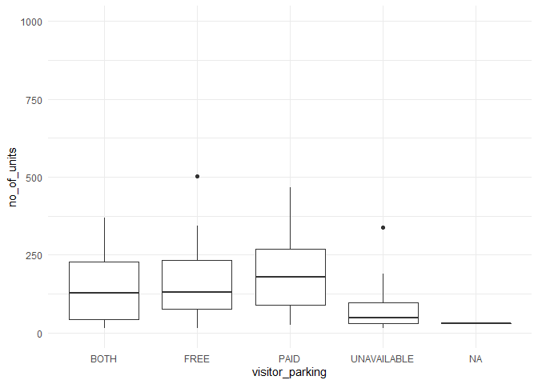
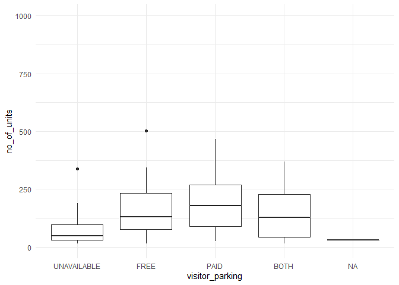
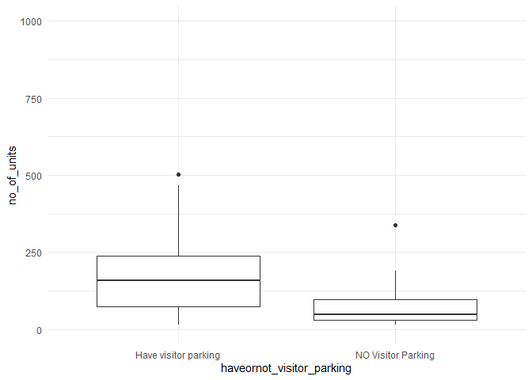

Mini Data Analysis Milestone 2
================

*To complete this milestone, you can edit [this `.rmd`
file](https://raw.githubusercontent.com/UBC-STAT/stat545.stat.ubc.ca/master/content/mini-project/mini-project-2.Rmd)
directly. Fill in the sections that are commented out with
`<!--- start your work here--->`. When you are done, make sure to knit
to an `.md` file by changing the output in the YAML header to
`github_document`, before submitting a tagged release on canvas.*

# Welcome to your second (and last) milestone in your mini data analysis project!

In Milestone 1, you explored your data, came up with research questions,
and obtained some results by making summary tables and graphs. This
time, we will first explore more in depth the concept of *tidy data.*
Then, you’ll be sharpening some of the results you obtained from your
previous milestone by:

-   Manipulating special data types in R: factors and/or dates and
    times.
-   Fitting a model object to your data, and extract a result.
-   Reading and writing data as separate files.

**NOTE**: The main purpose of the mini data analysis is to integrate
what you learn in class in an analysis. Although each milestone provides
a framework for you to conduct your analysis, it’s possible that you
might find the instructions too rigid for your data set. If this is the
case, you may deviate from the instructions – just make sure you’re
demonstrating a wide range of tools and techniques taught in this class.

# Instructions

**To complete this milestone**, edit [this very `.Rmd`
file](https://raw.githubusercontent.com/UBC-STAT/stat545.stat.ubc.ca/master/content/mini-project/mini-project-2.Rmd)
directly. Fill in the sections that are tagged with
`<!--- start your work here--->`.

**To submit this milestone**, make sure to knit this `.Rmd` file to an
`.md` file by changing the YAML output settings from
`output: html_document` to `output: github_document`. Commit and push
all of your work to your mini-analysis GitHub repository, and tag a
release on GitHub. Then, submit a link to your tagged release on canvas.

**Points**: This milestone is worth 55 points (compared to the 45 points
of the Milestone 1): 45 for your analysis, and 10 for your entire
mini-analysis GitHub repository. Details follow.

**Research Questions**: In Milestone 1, you chose two research questions
to focus on. Wherever realistic, your work in this milestone should
relate to these research questions whenever we ask for justification
behind your work. In the case that some tasks in this milestone don’t
align well with one of your research questions, feel free to discuss
your results in the context of a different research question.

# Learning Objectives

By the end of this milestone, you should:

-   Understand what *tidy* data is, and how to create it using `tidyr`.
-   Generate a reproducible and clear report using R Markdown.
-   Manipulating special data types in R: factors and/or dates and
    times.
-   Fitting a model object to your data, and extract a result.
-   Reading and writing data as separate files.

# Setup

Begin by loading your data and the tidyverse package below:

``` r
library(datateachr) # <- might contain the data you picked!
library(tidyverse)
```

# Task 1: Tidy your data (15 points)

In this task, we will do several exercises to reshape our data. The goal
here is to understand how to do this reshaping with the `tidyr` package.

A reminder of the definition of *tidy* data:

-   Each row is an **observation**
-   Each column is a **variable**
-   Each cell is a **value**

*Tidy’ing* data is sometimes necessary because it can simplify
computation. Other times it can be nice to organize data so that it can
be easier to understand when read manually.

### 2.1 (2.5 points)

Based on the definition above, can you identify if your data is tidy or
untidy? Go through all your columns, or if you have \>8 variables, just
pick 8, and explain whether the data is untidy or tidy.

<!--------------------------- Start your work below --------------------------->

``` r
### EXPLORE HERE ###
#apt_buildings
class(apt_buildings)
```

    ## [1] "tbl_df"     "tbl"        "data.frame"

``` r
head(apt_buildings)
```

    ## # A tibble: 6 x 37
    ##      id air_co~1 ameni~2 balco~3 barri~4 bike_~5 exter~6 fire_~7 garba~8 heati~9
    ##   <dbl> <chr>    <chr>   <chr>   <chr>   <chr>   <chr>   <chr>   <chr>   <chr>  
    ## 1 10359 NONE     Outdoo~ YES     YES     0 indo~ NO      YES     YES     HOT WA~
    ## 2 10360 NONE     Outdoo~ YES     NO      0 indo~ NO      YES     YES     HOT WA~
    ## 3 10361 NONE     <NA>    YES     NO      Not Av~ NO      YES     NO      HOT WA~
    ## 4 10362 NONE     <NA>    YES     YES     Not Av~ YES     YES     NO      HOT WA~
    ## 5 10363 NONE     <NA>    NO      NO      12 ind~ NO      YES     NO      HOT WA~
    ## 6 10364 NONE     <NA>    NO      NO      Not Av~ <NA>    YES     NO      HOT WA~
    ## # ... with 27 more variables: intercom <chr>, laundry_room <chr>,
    ## #   locker_or_storage_room <chr>, no_of_elevators <dbl>, parking_type <chr>,
    ## #   pets_allowed <chr>, prop_management_company_name <chr>,
    ## #   property_type <chr>, rsn <dbl>, separate_gas_meters <chr>,
    ## #   separate_hydro_meters <chr>, separate_water_meters <chr>,
    ## #   site_address <chr>, sprinkler_system <chr>, visitor_parking <chr>,
    ## #   ward <chr>, window_type <chr>, year_built <dbl>, year_registered <dbl>, ...

``` r
summary(apt_buildings)
```

    ##        id        air_conditioning    amenities          balconies        
    ##  Min.   :10359   Length:3455        Length:3455        Length:3455       
    ##  1st Qu.:11222   Class :character   Class :character   Class :character  
    ##  Median :12086   Mode  :character   Mode  :character   Mode  :character  
    ##  Mean   :12086                                                           
    ##  3rd Qu.:12950                                                           
    ##  Max.   :13813                                                           
    ##                                                                          
    ##  barrier_free_accessibilty_entr bike_parking       exterior_fire_escape
    ##  Length:3455                    Length:3455        Length:3455         
    ##  Class :character               Class :character   Class :character    
    ##  Mode  :character               Mode  :character   Mode  :character    
    ##                                                                        
    ##                                                                        
    ##                                                                        
    ##                                                                        
    ##   fire_alarm        garbage_chutes     heating_type         intercom        
    ##  Length:3455        Length:3455        Length:3455        Length:3455       
    ##  Class :character   Class :character   Class :character   Class :character  
    ##  Mode  :character   Mode  :character   Mode  :character   Mode  :character  
    ##                                                                             
    ##                                                                             
    ##                                                                             
    ##                                                                             
    ##  laundry_room       locker_or_storage_room no_of_elevators  parking_type      
    ##  Length:3455        Length:3455            Min.   : 0.000   Length:3455       
    ##  Class :character   Class :character       1st Qu.: 0.000   Class :character  
    ##  Mode  :character   Mode  :character       Median : 1.000   Mode  :character  
    ##                                            Mean   : 1.208                     
    ##                                            3rd Qu.: 2.000                     
    ##                                            Max.   :32.000                     
    ##                                            NA's   :5                          
    ##  pets_allowed       prop_management_company_name property_type     
    ##  Length:3455        Length:3455                  Length:3455       
    ##  Class :character   Class :character             Class :character  
    ##  Mode  :character   Mode  :character             Mode  :character  
    ##                                                                    
    ##                                                                    
    ##                                                                    
    ##                                                                    
    ##       rsn          separate_gas_meters separate_hydro_meters
    ##  Min.   :4152554   Length:3455         Length:3455          
    ##  1st Qu.:4153682   Class :character    Class :character     
    ##  Median :4154598   Mode  :character    Mode  :character     
    ##  Mean   :4167867                                            
    ##  3rd Qu.:4155538                                            
    ##  Max.   :4716349                                            
    ##                                                             
    ##  separate_water_meters site_address       sprinkler_system   visitor_parking   
    ##  Length:3455           Length:3455        Length:3455        Length:3455       
    ##  Class :character      Class :character   Class :character   Class :character  
    ##  Mode  :character      Mode  :character   Mode  :character   Mode  :character  
    ##                                                                                
    ##                                                                                
    ##                                                                                
    ##                                                                                
    ##      ward           window_type          year_built   year_registered
    ##  Length:3455        Length:3455        Min.   :1805   Min.   :2017   
    ##  Class :character   Class :character   1st Qu.:1955   1st Qu.:2017   
    ##  Mode  :character   Mode  :character   Median :1962   Median :2017   
    ##                                        Mean   :1962   Mean   :2017   
    ##                                        3rd Qu.:1970   3rd Qu.:2017   
    ##                                        Max.   :2019   Max.   :2020   
    ##                                        NA's   :13     NA's   :89     
    ##  no_of_storeys    emergency_power    non-smoking_building  no_of_units     
    ##  Min.   : 0.000   Length:3455        Length:3455          Min.   :   0.00  
    ##  1st Qu.: 3.000   Class :character   Class :character     1st Qu.:  25.00  
    ##  Median : 5.000   Mode  :character   Mode  :character     Median :  52.00  
    ##  Mean   : 7.738                                           Mean   :  91.09  
    ##  3rd Qu.:10.000                                           3rd Qu.: 124.00  
    ##  Max.   :51.000                                           Max.   :4111.00  
    ##                                                                            
    ##  no_of_accessible_parking_spaces facilities_available cooling_room      
    ##  Min.   :  0.000                 Length:3455          Length:3455       
    ##  1st Qu.:  0.000                 Class :character     Class :character  
    ##  Median :  1.000                 Mode  :character     Mode  :character  
    ##  Mean   :  6.559                                                        
    ##  3rd Qu.:  5.000                                                        
    ##  Max.   :340.000                                                        
    ##  NA's   :123                                                            
    ##  no_barrier_free_accessible_units
    ##  Min.   :  0.000                 
    ##  1st Qu.:  0.000                 
    ##  Median :  0.000                 
    ##  Mean   :  9.408                 
    ##  3rd Qu.:  1.000                 
    ##  Max.   :474.000                 
    ##  NA's   :154

``` r
glimpse(apt_buildings)
```

    ## Rows: 3,455
    ## Columns: 37
    ## $ id                               <dbl> 10359, 10360, 10361, 10362, 10363, 10~
    ## $ air_conditioning                 <chr> "NONE", "NONE", "NONE", "NONE", "NONE~
    ## $ amenities                        <chr> "Outdoor rec facilities", "Outdoor po~
    ## $ balconies                        <chr> "YES", "YES", "YES", "YES", "NO", "NO~
    ## $ barrier_free_accessibilty_entr   <chr> "YES", "NO", "NO", "YES", "NO", "NO",~
    ## $ bike_parking                     <chr> "0 indoor parking spots and 10 outdoo~
    ## $ exterior_fire_escape             <chr> "NO", "NO", "NO", "YES", "NO", NA, "N~
    ## $ fire_alarm                       <chr> "YES", "YES", "YES", "YES", "YES", "Y~
    ## $ garbage_chutes                   <chr> "YES", "YES", "NO", "NO", "NO", "NO",~
    ## $ heating_type                     <chr> "HOT WATER", "HOT WATER", "HOT WATER"~
    ## $ intercom                         <chr> "YES", "YES", "YES", "YES", "YES", "Y~
    ## $ laundry_room                     <chr> "YES", "YES", "YES", "YES", "YES", "Y~
    ## $ locker_or_storage_room           <chr> "NO", "YES", "YES", "YES", "NO", "YES~
    ## $ no_of_elevators                  <dbl> 3, 3, 0, 1, 0, 0, 0, 2, 4, 2, 0, 2, 2~
    ## $ parking_type                     <chr> "Underground Garage , Garage accessib~
    ## $ pets_allowed                     <chr> "YES", "YES", "YES", "YES", "YES", "Y~
    ## $ prop_management_company_name     <chr> NA, "SCHICKEDANZ BROS. PROPERTIES", N~
    ## $ property_type                    <chr> "PRIVATE", "PRIVATE", "PRIVATE", "PRI~
    ## $ rsn                              <dbl> 4154812, 4154815, 4155295, 4155309, 4~
    ## $ separate_gas_meters              <chr> "NO", "NO", "NO", "NO", "NO", "NO", "~
    ## $ separate_hydro_meters            <chr> "YES", "YES", "YES", "YES", "YES", "Y~
    ## $ separate_water_meters            <chr> "NO", "NO", "NO", "NO", "NO", "NO", "~
    ## $ site_address                     <chr> "65  FOREST MANOR RD", "70  CLIPPER R~
    ## $ sprinkler_system                 <chr> "YES", "YES", "NO", "YES", "NO", "NO"~
    ## $ visitor_parking                  <chr> "PAID", "FREE", "UNAVAILABLE", "UNAVA~
    ## $ ward                             <chr> "17", "17", "03", "03", "02", "02", "~
    ## $ window_type                      <chr> "DOUBLE PANE", "DOUBLE PANE", "DOUBLE~
    ## $ year_built                       <dbl> 1967, 1970, 1927, 1959, 1943, 1952, 1~
    ## $ year_registered                  <dbl> 2017, 2017, 2017, 2017, 2017, NA, 201~
    ## $ no_of_storeys                    <dbl> 17, 14, 4, 5, 4, 4, 4, 7, 32, 4, 4, 7~
    ## $ emergency_power                  <chr> "NO", "YES", "NO", "NO", "NO", "NO", ~
    ## $ `non-smoking_building`           <chr> "YES", "NO", "YES", "YES", "YES", "NO~
    ## $ no_of_units                      <dbl> 218, 206, 34, 42, 25, 34, 14, 105, 57~
    ## $ no_of_accessible_parking_spaces  <dbl> 8, 10, 20, 42, 12, 0, 5, 1, 1, 6, 12,~
    ## $ facilities_available             <chr> "Recycling bins", "Green Bin / Organi~
    ## $ cooling_room                     <chr> "NO", "NO", "NO", "NO", "NO", "NO", "~
    ## $ no_barrier_free_accessible_units <dbl> 2, 0, 0, 42, 0, NA, 14, 0, 0, 1, 25, ~

Examining the head() output, I see that each variables of this data set
forms a separate columns, while each observations with unique ID from
10369 to 13813 occupy a single row, and each cell corresponds with the
value of each observation for that variables. Thus this apt_buildings
data is tidy.

<!----------------------------------------------------------------------------->

### 2.2 (5 points)

Now, if your data is tidy, untidy it! Then, tidy it back to it’s
original state.

If your data is untidy, then tidy it! Then, untidy it back to it’s
original state.

Be sure to explain your reasoning for this task. Show us the “before”
and “after”.

<!--------------------------- Start your work below --------------------------->

**Before**

``` r
### Tidy ###
head(apt_buildings)
```

    ## # A tibble: 6 x 37
    ##      id air_co~1 ameni~2 balco~3 barri~4 bike_~5 exter~6 fire_~7 garba~8 heati~9
    ##   <dbl> <chr>    <chr>   <chr>   <chr>   <chr>   <chr>   <chr>   <chr>   <chr>  
    ## 1 10359 NONE     Outdoo~ YES     YES     0 indo~ NO      YES     YES     HOT WA~
    ## 2 10360 NONE     Outdoo~ YES     NO      0 indo~ NO      YES     YES     HOT WA~
    ## 3 10361 NONE     <NA>    YES     NO      Not Av~ NO      YES     NO      HOT WA~
    ## 4 10362 NONE     <NA>    YES     YES     Not Av~ YES     YES     NO      HOT WA~
    ## 5 10363 NONE     <NA>    NO      NO      12 ind~ NO      YES     NO      HOT WA~
    ## 6 10364 NONE     <NA>    NO      NO      Not Av~ <NA>    YES     NO      HOT WA~
    ## # ... with 27 more variables: intercom <chr>, laundry_room <chr>,
    ## #   locker_or_storage_room <chr>, no_of_elevators <dbl>, parking_type <chr>,
    ## #   pets_allowed <chr>, prop_management_company_name <chr>,
    ## #   property_type <chr>, rsn <dbl>, separate_gas_meters <chr>,
    ## #   separate_hydro_meters <chr>, separate_water_meters <chr>,
    ## #   site_address <chr>, sprinkler_system <chr>, visitor_parking <chr>,
    ## #   ward <chr>, window_type <chr>, year_built <dbl>, year_registered <dbl>, ...

**After**

``` r
### Untidy ###
# Expand the type of parking and make them into separate columns
untidy<- apt_buildings %>% pivot_wider(names_from = visitor_parking, values_from = no_of_units)
head(untidy)
```

    ## # A tibble: 6 x 40
    ##      id air_co~1 ameni~2 balco~3 barri~4 bike_~5 exter~6 fire_~7 garba~8 heati~9
    ##   <dbl> <chr>    <chr>   <chr>   <chr>   <chr>   <chr>   <chr>   <chr>   <chr>  
    ## 1 10359 NONE     Outdoo~ YES     YES     0 indo~ NO      YES     YES     HOT WA~
    ## 2 10360 NONE     Outdoo~ YES     NO      0 indo~ NO      YES     YES     HOT WA~
    ## 3 10361 NONE     <NA>    YES     NO      Not Av~ NO      YES     NO      HOT WA~
    ## 4 10362 NONE     <NA>    YES     YES     Not Av~ YES     YES     NO      HOT WA~
    ## 5 10363 NONE     <NA>    NO      NO      12 ind~ NO      YES     NO      HOT WA~
    ## 6 10364 NONE     <NA>    NO      NO      Not Av~ <NA>    YES     NO      HOT WA~
    ## # ... with 30 more variables: intercom <chr>, laundry_room <chr>,
    ## #   locker_or_storage_room <chr>, no_of_elevators <dbl>, parking_type <chr>,
    ## #   pets_allowed <chr>, prop_management_company_name <chr>,
    ## #   property_type <chr>, rsn <dbl>, separate_gas_meters <chr>,
    ## #   separate_hydro_meters <chr>, separate_water_meters <chr>,
    ## #   site_address <chr>, sprinkler_system <chr>, ward <chr>, window_type <chr>,
    ## #   year_built <dbl>, year_registered <dbl>, no_of_storeys <dbl>, ...

**Re-tidy**

``` r
### Tidy again ###
tidy<- untidy %>% pivot_longer(cols =c("PAID","FREE","UNAVAILABLE","BOTH","NA"),names_to = "visitor_parking", values_to ="no_of_units") 
head(tidy)
```

    ## # A tibble: 6 x 37
    ##      id air_co~1 ameni~2 balco~3 barri~4 bike_~5 exter~6 fire_~7 garba~8 heati~9
    ##   <dbl> <chr>    <chr>   <chr>   <chr>   <chr>   <chr>   <chr>   <chr>   <chr>  
    ## 1 10359 NONE     Outdoo~ YES     YES     0 indo~ NO      YES     YES     HOT WA~
    ## 2 10359 NONE     Outdoo~ YES     YES     0 indo~ NO      YES     YES     HOT WA~
    ## 3 10359 NONE     Outdoo~ YES     YES     0 indo~ NO      YES     YES     HOT WA~
    ## 4 10359 NONE     Outdoo~ YES     YES     0 indo~ NO      YES     YES     HOT WA~
    ## 5 10359 NONE     Outdoo~ YES     YES     0 indo~ NO      YES     YES     HOT WA~
    ## 6 10360 NONE     Outdoo~ YES     NO      0 indo~ NO      YES     YES     HOT WA~
    ## # ... with 27 more variables: intercom <chr>, laundry_room <chr>,
    ## #   locker_or_storage_room <chr>, no_of_elevators <dbl>, parking_type <chr>,
    ## #   pets_allowed <chr>, prop_management_company_name <chr>,
    ## #   property_type <chr>, rsn <dbl>, separate_gas_meters <chr>,
    ## #   separate_hydro_meters <chr>, separate_water_meters <chr>,
    ## #   site_address <chr>, sprinkler_system <chr>, ward <chr>, window_type <chr>,
    ## #   year_built <dbl>, year_registered <dbl>, no_of_storeys <dbl>, ...

**Explanation** because apt_buildings data set already is tidy, I
un-tidy it and then re-tidy it following the instructions.

<!----------------------------------------------------------------------------->

### 2.3 (7.5 points)

Now, you should be more familiar with your data, and also have made
progress in answering your research questions. Based on your interest,
and your analyses, pick 2 of the 4 research questions to continue your
analysis in the next four tasks:

<!-------------------------- Start your work below ---------------------------->

1.  *Research question 1*: Are newer buildings more likely to have
    barrier-free accessibility entry? -\>**New question 1:** Are
    buildings built after year 2000 have more barrier-free accessibility
    entry then buildings built before 2000 for the same number of units?
2.  *Research question 2*: Are there any relationship between the types
    of visitor parking available and the size of building in term of
    number of units? -\>**New question 2:** Are there any relationships
    between the type of visitor parking available and the size of
    building in term of number of units in buildings built after year
    2000?

<!----------------------------------------------------------------------------->

Explain your decision for choosing the above two research questions.

<!--------------------------- Start your work below --------------------------->

1.  **New question 1:** I want to know whether buildings built after
    year 2000 have more barrier-free accessibility entry then building
    built before 2000 for the same number of units. The degree of
    complexity is enough for me to apply the functions to refine the
    data.
2.  **New question 2:** I want to know whether there a relationship
    between the type of visitor parking available and the size of
    building in term of number of units in building built after
    year 2000. The degree of complexity is enough for me to apply the
    functions to refine the data.

<!----------------------------------------------------------------------------->

Now, try to choose a version of your data that you think will be
appropriate to answer these 2 questions. Use between 4 and 8 functions
that we’ve covered so far (i.e. by filtering, cleaning, tidy’ing,
dropping irrelevant columns, etc.).

<!--------------------------- Start your work below --------------------------->

**Question 1:** Functions use select, arrange, mutate, group by,
summarize

``` r
apt_buildings %>% select("id","no_of_units","no_barrier_free_accessible_units","year_built") %>% arrange(no_of_units)%>%  mutate(free_access_unit_per_total_unit=no_barrier_free_accessible_units/no_of_units) %>% group_by(year_built) %>% summarize(mean_number_of_freeaccess_unit=mean(free_access_unit_per_total_unit))
```

    ## # A tibble: 128 x 2
    ##    year_built mean_number_of_freeaccess_unit
    ##         <dbl>                          <dbl>
    ##  1       1805                         0     
    ##  2       1809                         0     
    ##  3       1838                         0.2   
    ##  4       1880                         0     
    ##  5       1885                         0.0357
    ##  6       1888                         0     
    ##  7       1890                         0     
    ##  8       1891                         0     
    ##  9       1895                         0     
    ## 10       1896                         0     
    ## # ... with 118 more rows

**Question 2:** FUnctions use filter, select, rrange, group by,
summarize

``` r
apt_buildings %>% filter(year_built>=2000) %>% select("id","no_of_units","visitor_parking") %>% arrange(no_of_units)%>% group_by(visitor_parking)%>% summarise(mean_number_of_unit=mean(no_of_units))
```

    ## # A tibble: 5 x 2
    ##   visitor_parking mean_number_of_unit
    ##   <chr>                         <dbl>
    ## 1 BOTH                          150. 
    ## 2 FREE                          254. 
    ## 3 PAID                          192. 
    ## 4 UNAVAILABLE                    70.6
    ## 5 <NA>                           30

<!----------------------------------------------------------------------------->

# Task 2: Special Data Types (10)

For this exercise, you’ll be choosing two of the three tasks below –
both tasks that you choose are worth 5 points each.

But first, tasks 1 and 2 below ask you to modify a plot you made in a
previous milestone. The plot you choose should involve plotting across
at least three groups (whether by facetting, or using an aesthetic like
colour). Place this plot below (you’re allowed to modify the plot if
you’d like). If you don’t have such a plot, you’ll need to make one.
Place the code for your plot below.

<!-------------------------- Start your work below ---------------------------->

``` r
apt_buildings %>% filter(year_built>=2000) %>% select("id","no_of_units","visitor_parking") %>% ggplot(aes(x = visitor_parking, y=no_of_units)) + geom_boxplot() + theme_minimal() + ylim(0,1000)
```

    ## Warning: Removed 1 rows containing non-finite values (stat_boxplot).

<!-- -->
<!----------------------------------------------------------------------------->

Now, choose two of the following tasks.

1.  Produce a new plot that reorders a factor in your original plot,
    using the `forcats` package (3 points). Then, in a sentence or two,
    briefly explain why you chose this ordering (1 point here for
    demonstrating understanding of the reordering, and 1 point for
    demonstrating some justification for the reordering, which could be
    subtle or speculative.)

2.  Produce a new plot that groups some factor levels together into an
    “other” category (or something similar), using the `forcats` package
    (3 points). Then, in a sentence or two, briefly explain why you
    chose this grouping (1 point here for demonstrating understanding of
    the grouping, and 1 point for demonstrating some justification for
    the grouping, which could be subtle or speculative.)

3.  If your data has some sort of time-based column like a date (but
    something more granular than just a year):

    1.  Make a new column that uses a function from the `lubridate` or
        `tsibble` package to modify your original time-based column. (3
        points)

        -   Note that you might first have to *make* a time-based column
            using a function like `ymd()`, but this doesn’t count.
        -   Examples of something you might do here: extract the day of
            the year from a date, or extract the weekday, or let 24
            hours elapse on your dates.

    2.  Then, in a sentence or two, explain how your new column might be
        useful in exploring a research question. (1 point for
        demonstrating understanding of the function you used, and 1
        point for your justification, which could be subtle or
        speculative).

        -   For example, you could say something like “Investigating the
            day of the week might be insightful because penguins don’t
            work on weekends, and so may respond differently”.

<!-------------------------- Start your work below ---------------------------->

**Task Number**: 1

``` r
library(forcats)
# re-order
reorder_apt_buildings <- apt_buildings %>%
   mutate(visitor_parking = fct_reorder(visitor_parking, no_of_units,.fun = median, .desc = FALSE))
head(reorder_apt_buildings)
```

    ## # A tibble: 6 x 37
    ##      id air_co~1 ameni~2 balco~3 barri~4 bike_~5 exter~6 fire_~7 garba~8 heati~9
    ##   <dbl> <chr>    <chr>   <chr>   <chr>   <chr>   <chr>   <chr>   <chr>   <chr>  
    ## 1 10359 NONE     Outdoo~ YES     YES     0 indo~ NO      YES     YES     HOT WA~
    ## 2 10360 NONE     Outdoo~ YES     NO      0 indo~ NO      YES     YES     HOT WA~
    ## 3 10361 NONE     <NA>    YES     NO      Not Av~ NO      YES     NO      HOT WA~
    ## 4 10362 NONE     <NA>    YES     YES     Not Av~ YES     YES     NO      HOT WA~
    ## 5 10363 NONE     <NA>    NO      NO      12 ind~ NO      YES     NO      HOT WA~
    ## 6 10364 NONE     <NA>    NO      NO      Not Av~ <NA>    YES     NO      HOT WA~
    ## # ... with 27 more variables: intercom <chr>, laundry_room <chr>,
    ## #   locker_or_storage_room <chr>, no_of_elevators <dbl>, parking_type <chr>,
    ## #   pets_allowed <chr>, prop_management_company_name <chr>,
    ## #   property_type <chr>, rsn <dbl>, separate_gas_meters <chr>,
    ## #   separate_hydro_meters <chr>, separate_water_meters <chr>,
    ## #   site_address <chr>, sprinkler_system <chr>, visitor_parking <fct>,
    ## #   ward <chr>, window_type <chr>, year_built <dbl>, year_registered <dbl>, ...

``` r
# Graph
reorder_apt_buildings %>% filter(year_built>=2000) %>% select("id","no_of_units","visitor_parking") %>% ggplot(aes(x = visitor_parking, y=no_of_units)) + geom_boxplot() + theme_minimal() + ylim(0,1000) 
```

    ## Warning: Removed 1 rows containing non-finite values (stat_boxplot).

<!-- --> -
Explanation: I want to order the type of visitor parking in the
increasing order of their average number of units. Because I suspect the
larger building (with more units) are more likely to have visitor
parking of all types (Both, free, paid), whereas smaller units may have
no visitor parking available.
<!----------------------------------------------------------------------------->

<!-------------------------- Start your work below ---------------------------->

**Task Number**: 2

``` r
# Group
Group_apt_buildings <- apt_buildings %>%
   mutate(haveornot_visitor_parking = factor(case_when(visitor_parking=="UNAVAILABLE"~"NO Visitor Parking", TRUE ~ "Have visitor parking")))

head(Group_apt_buildings)
```

    ## # A tibble: 6 x 38
    ##      id air_co~1 ameni~2 balco~3 barri~4 bike_~5 exter~6 fire_~7 garba~8 heati~9
    ##   <dbl> <chr>    <chr>   <chr>   <chr>   <chr>   <chr>   <chr>   <chr>   <chr>  
    ## 1 10359 NONE     Outdoo~ YES     YES     0 indo~ NO      YES     YES     HOT WA~
    ## 2 10360 NONE     Outdoo~ YES     NO      0 indo~ NO      YES     YES     HOT WA~
    ## 3 10361 NONE     <NA>    YES     NO      Not Av~ NO      YES     NO      HOT WA~
    ## 4 10362 NONE     <NA>    YES     YES     Not Av~ YES     YES     NO      HOT WA~
    ## 5 10363 NONE     <NA>    NO      NO      12 ind~ NO      YES     NO      HOT WA~
    ## 6 10364 NONE     <NA>    NO      NO      Not Av~ <NA>    YES     NO      HOT WA~
    ## # ... with 28 more variables: intercom <chr>, laundry_room <chr>,
    ## #   locker_or_storage_room <chr>, no_of_elevators <dbl>, parking_type <chr>,
    ## #   pets_allowed <chr>, prop_management_company_name <chr>,
    ## #   property_type <chr>, rsn <dbl>, separate_gas_meters <chr>,
    ## #   separate_hydro_meters <chr>, separate_water_meters <chr>,
    ## #   site_address <chr>, sprinkler_system <chr>, visitor_parking <chr>,
    ## #   ward <chr>, window_type <chr>, year_built <dbl>, year_registered <dbl>, ...

``` r
# Graph
Group_apt_buildings %>% filter(year_built>=2000) %>% select("id","no_of_units","visitor_parking","haveornot_visitor_parking") %>% ggplot(aes(x = haveornot_visitor_parking, y=no_of_units)) + geom_boxplot() + theme_minimal() + ylim(0,1000)
```

    ## Warning: Removed 1 rows containing non-finite values (stat_boxplot).

<!-- --> -
Explanation: Since I narrow down on whether I want to know whether
larger building in term of units more likely to have a visitor parking
regardless of type (paid, free, both), I grouped all types of visitor
parking into a group “have visitor parking”, whereas those where visitor
parking is unavailable is change into “NO visitor parking”.
<!----------------------------------------------------------------------------->

# Task 3: Modelling

## 2.0 (no points)

Pick a research question, and pick a variable of interest (we’ll call it
“Y”) that’s relevant to the research question. Indicate these.

<!-------------------------- Start your work below ---------------------------->

**Research Question**: How does factors such as the number of units
(no_of_units),and the type of visitor (visitor_parking) predict the
numbers of accessible parking spaces (no_of_accessible_parking_spaces)
of a building?

**Variable of interest**: y = no_of_accessible_parking_spaces

<!----------------------------------------------------------------------------->

## 2.1 (5 points)

Fit a model or run a hypothesis test that provides insight on this
variable with respect to the research question. Store the model object
as a variable, and print its output to screen. We’ll omit having to
justify your choice, because we don’t expect you to know about model
specifics in STAT 545.

-   **Note**: It’s OK if you don’t know how these models/tests work.
    Here are some examples of things you can do here, but the sky’s the
    limit.

    -   You could fit a model that makes predictions on Y using another
        variable, by using the `lm()` function.
    -   You could test whether the mean of Y equals 0 using `t.test()`,
        or maybe the mean across two groups are different using
        `t.test()`, or maybe the mean across multiple groups are
        different using `anova()` (you may have to pivot your data for
        the latter two).
    -   You could use `lm()` to test for significance of regression.

<!-------------------------- Start your work below ---------------------------->

``` r
#Fit a model to predict the number of accessible parking based on number of units and type of visitor parking
accessible_parking_lm <- lm(no_of_accessible_parking_spaces ~ no_of_units+visitor_parking, data = apt_buildings)
accessible_parking_lm
```

    ## 
    ## Call:
    ## lm(formula = no_of_accessible_parking_spaces ~ no_of_units + 
    ##     visitor_parking, data = apt_buildings)
    ## 
    ## Coefficients:
    ##                (Intercept)                 no_of_units  
    ##                    6.22386                    -0.00062  
    ##        visitor_parkingFREE         visitor_parkingPAID  
    ##                    1.94828                    -1.86274  
    ## visitor_parkingUNAVAILABLE  
    ##                   -0.53573

<!----------------------------------------------------------------------------->

## 2.2 (5 points)

Produce something relevant from your fitted model: either predictions on
Y, or a single value like a regression coefficient or a p-value.

-   Be sure to indicate in writing what you chose to produce.
-   Your code should either output a tibble (in which case you should
    indicate the column that contains the thing you’re looking for), or
    the thing you’re looking for itself.
-   Obtain your results using the `broom` package if possible. If your
    model is not compatible with the broom function you’re needing, then
    you can obtain your results by some other means, but first indicate
    which broom function is not compatible.

<!-------------------------- Start your work below ---------------------------->

``` r
library(broom)
#extract statistical summaries about each “component” of the model,like a regression coefficient or a p-value. The coefficient and p-values for each variables can be seen in the "estimate" and "p-value" columns of the tibble, respectively. 
tidy(accessible_parking_lm)
```

    ## # A tibble: 5 x 5
    ##   term                        estimate std.error statistic     p.value
    ##   <chr>                          <dbl>     <dbl>     <dbl>       <dbl>
    ## 1 (Intercept)                 6.22       1.18        5.26  0.000000152
    ## 2 no_of_units                -0.000620   0.00263    -0.236 0.813      
    ## 3 visitor_parkingFREE         1.95       1.19        1.63  0.103      
    ## 4 visitor_parkingPAID        -1.86       1.37       -1.36  0.175      
    ## 5 visitor_parkingUNAVAILABLE -0.536      1.23       -0.435 0.664

``` r
#predictions on Y
augment(accessible_parking_lm, newdata = tibble(no_of_units = 100, visitor_parking ="PAID")) 
```

    ## # A tibble: 1 x 3
    ##   no_of_units visitor_parking .fitted
    ##         <dbl> <chr>             <dbl>
    ## 1         100 PAID               4.30

``` r
# based on the result, it could be predicted that 100 units building with paid visitor parking will have around 4 accessible parking spaces.
```

<!----------------------------------------------------------------------------->

# Task 4: Reading and writing data

Get set up for this exercise by making a folder called `output` in the
top level of your project folder / repository. You’ll be saving things
there.

## 3.1 (5 points)

Take a summary table that you made from Milestone 1 (Task 4.2), and
write it as a csv file in your `output` folder. Use the `here::here()`
function.

-   **Robustness criteria**: You should be able to move your Mini
    Project repository / project folder to some other location on your
    computer, or move this very Rmd file to another location within your
    project repository / folder, and your code should still work.
-   **Reproducibility criteria**: You should be able to delete the csv
    file, and remake it simply by knitting this Rmd file.

<!-------------------------- Start your work below ---------------------------->

``` r
library(here)
```

    ## here() starts at C:/Users/Tri Van/Desktop/UBC PhamSci/UBC Y2 FALL 2022/STAT 545A Exploratory Data Analysis/Tri_Van_Mini-Data-Analysis-1and2

``` r
write_csv(Group_apt_buildings,here("Output", "Task4_Group_apt_buildings.csv"))
```

<!----------------------------------------------------------------------------->

## 3.2 (5 points)

Write your model object from Task 3 to an R binary file (an RDS), and
load it again. Be sure to save the binary file in your `output` folder.
Use the functions `saveRDS()` and `readRDS()`.

-   The same robustness and reproducibility criteria as in 3.1 apply
    here.

<!-------------------------- Start your work below ---------------------------->

``` r
saveRDS(accessible_parking_lm, file=here("Output", "accessible_parking_lm.rds"))
accessible_parking_lm_again<-readRDS(file=here("Output", "accessible_parking_lm.rds"))
accessible_parking_lm_again
```

    ## 
    ## Call:
    ## lm(formula = no_of_accessible_parking_spaces ~ no_of_units + 
    ##     visitor_parking, data = apt_buildings)
    ## 
    ## Coefficients:
    ##                (Intercept)                 no_of_units  
    ##                    6.22386                    -0.00062  
    ##        visitor_parkingFREE         visitor_parkingPAID  
    ##                    1.94828                    -1.86274  
    ## visitor_parkingUNAVAILABLE  
    ##                   -0.53573

<!----------------------------------------------------------------------------->

# Tidy Repository

Now that this is your last milestone, your entire project repository
should be organized. Here are the criteria we’re looking for.

## Main README (3 points)

There should be a file named `README.md` at the top level of your
repository. Its contents should automatically appear when you visit the
repository on GitHub.

Minimum contents of the README file:

-   In a sentence or two, explains what this repository is, so that
    future-you or someone else stumbling on your repository can be
    oriented to the repository.
-   In a sentence or two (or more??), briefly explains how to engage
    with the repository. You can assume the person reading knows the
    material from STAT 545A. Basically, if a visitor to your repository
    wants to explore your project, what should they know?

Once you get in the habit of making README files, and seeing more README
files in other projects, you’ll wonder how you ever got by without them!
They are tremendously helpful.

## File and Folder structure (3 points)

You should have at least four folders in the top level of your
repository: one for each milestone, and one output folder. If there are
any other folders, these are explained in the main README.

Each milestone document is contained in its respective folder, and
nowhere else.

Every level-1 folder (that is, the ones stored in the top level, like
“Milestone1” and “output”) has a `README` file, explaining in a sentence
or two what is in the folder, in plain language (it’s enough to say
something like “This folder contains the source for Milestone 1”).

## Output (2 points)

All output is recent and relevant:

-   All Rmd files have been `knit`ted to their output, and all data
    files saved from Task 4 above appear in the `output` folder.
-   All of these output files are up-to-date – that is, they haven’t
    fallen behind after the source (Rmd) files have been updated.
-   There should be no relic output files. For example, if you were
    knitting an Rmd to html, but then changed the output to be only a
    markdown file, then the html file is a relic and should be deleted.

Our recommendation: delete all output files, and re-knit each
milestone’s Rmd file, so that everything is up to date and relevant.

PS: there’s a way where you can run all project code using a single
command, instead of clicking “knit” three times. More on this in STAT
545B!

## Error-free code (1 point)

This Milestone 1 document knits error-free, and the Milestone 2 document
knits error-free.

## Tagged release (1 point)

You’ve tagged a release for Milestone 1, and you’ve tagged a release for
Milestone 2.

### Attribution

Thanks to Victor Yuan for mostly putting th
