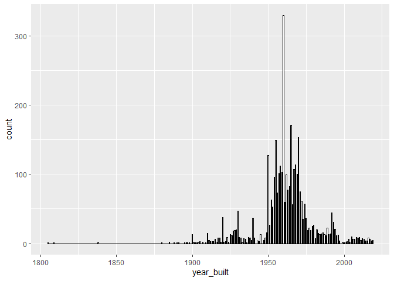
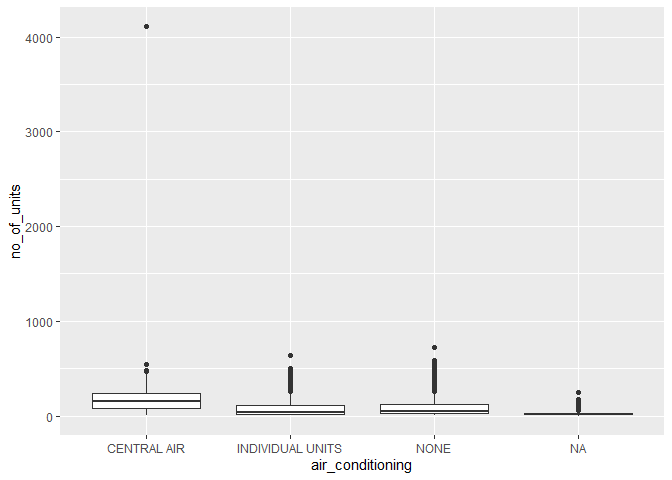
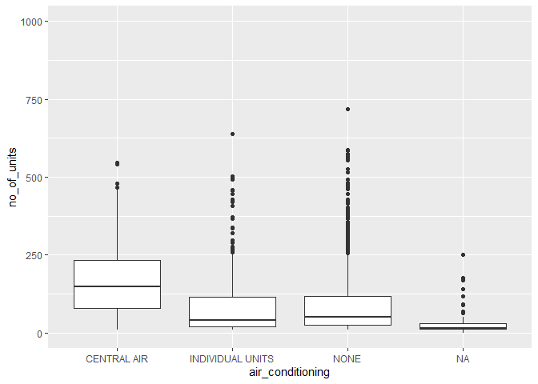
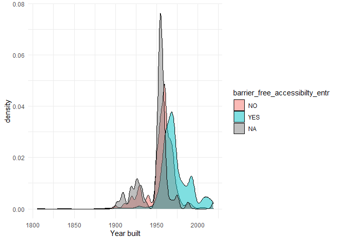
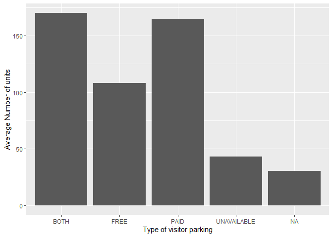
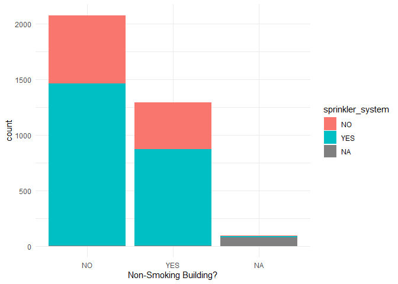
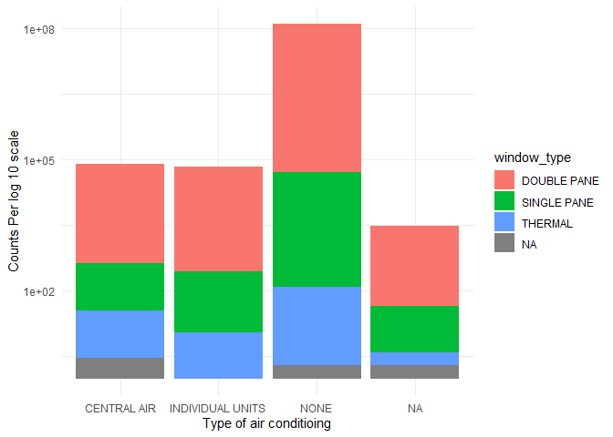

TV_Mini_Data-Analysis_Deliverable_1
================

# Welcome to your (maybe) first-ever data analysis project!

And hopefully the first of many. Let’s get started:

1.  Install the [`datateachr`](https://github.com/UBC-MDS/datateachr)
    package by typing the following into your **R terminal**:

<!-- -->

    install.packages("devtools")
    devtools::install_github("UBC-MDS/datateachr")

2.  Load the packages below.

``` r
library(datateachr)
library(tidyverse)
```

    ## -- Attaching packages --------------------------------------- tidyverse 1.3.2 --
    ## v ggplot2 3.3.6      v purrr   0.3.4 
    ## v tibble  3.1.8      v dplyr   1.0.10
    ## v tidyr   1.2.1      v stringr 1.4.1 
    ## v readr   2.1.2      v forcats 0.5.2 
    ## -- Conflicts ------------------------------------------ tidyverse_conflicts() --
    ## x dplyr::filter() masks stats::filter()
    ## x dplyr::lag()    masks stats::lag()

3.  Make a repository in the <https://github.com/stat545ubc-2022>
    Organization. You will be working with this repository for the
    entire data analysis project. You can either make it public, or make
    it private and add the TA’s and Lucy as collaborators. A link to
    help you create a private repository is available on the
    \#collaborative-project Slack channel.

# Instructions

## For Both Milestones

-   Each milestone is worth 45 points. The number of points allocated to
    each task will be annotated within each deliverable. Tasks that are
    more challenging will often be allocated more points.

-   10 points will be allocated to the reproducibility, cleanliness, and
    coherence of the overall analysis. While the two milestones will be
    submitted as independent deliverables, the analysis itself is a
    continuum - think of it as two chapters to a story. Each chapter, or
    in this case, portion of your analysis, should be easily followed
    through by someone unfamiliar with the content.
    [Here](https://swcarpentry.github.io/r-novice-inflammation/06-best-practices-R/)
    is a good resource for what constitutes “good code”. Learning good
    coding practices early in your career will save you hassle later on!

## For Milestone 1

**To complete this milestone**, edit [this very `.Rmd`
file](https://raw.githubusercontent.com/UBC-STAT/stat545.stat.ubc.ca/master/content/mini-project/mini-project-1.Rmd)
directly. Fill in the sections that are tagged with
`<!--- start your work below --->`.

**To submit this milestone**, make sure to knit this `.Rmd` file to an
`.md` file by changing the YAML output settings from
`output: html_document` to `output: github_document`. Commit and push
all of your work to the mini-analysis GitHub repository you made
earlier, and tag a release on GitHub. Then, submit a link to your tagged
release on canvas.

**Points**: This milestone is worth 45 points: 43 for your analysis, 1
point for having your Milestone 1 document knit error-free, and 1 point
for tagging your release on Github.

# Learning Objectives

By the end of this milestone, you should:

-   Become familiar with your dataset of choosing
-   Select 4 questions that you would like to answer with your data
-   Generate a reproducible and clear report using R Markdown
-   Become familiar with manipulating and summarizing your data in
    tibbles using `dplyr`, with a research question in mind.

# Task 1: Choose your favorite dataset (10 points)

The `datateachr` package by Hayley Boyce and Jordan Bourak currently
composed of 7 semi-tidy datasets for educational purposes. Here is a
brief description of each dataset:

-   *apt_buildings*: Acquired courtesy of The City of Toronto’s Open
    Data Portal. It currently has 3455 rows and 37 columns.

-   *building_permits*: Acquired courtesy of The City of Vancouver’s
    Open Data Portal. It currently has 20680 rows and 14 columns.

-   *cancer_sample*: Acquired courtesy of UCI Machine Learning
    Repository. It currently has 569 rows and 32 columns.

-   *flow_sample*: Acquired courtesy of The Government of Canada’s
    Historical Hydrometric Database. It currently has 218 rows and 7
    columns.

-   *parking_meters*: Acquired courtesy of The City of Vancouver’s Open
    Data Portal. It currently has 10032 rows and 22 columns.

-   *steam_games*: Acquired courtesy of Kaggle. It currently has 40833
    rows and 21 columns.

-   *vancouver_trees*: Acquired courtesy of The City of Vancouver’s Open
    Data Portal. It currently has 146611 rows and 20 columns.

**Things to keep in mind**

-   We hope that this project will serve as practice for carrying our
    your own *independent* data analysis. Remember to comment your code,
    be explicit about what you are doing, and write notes in this
    markdown document when you feel that context is required. As you
    advance in the project, prompts and hints to do this will be
    diminished - it’ll be up to you!

-   Before choosing a dataset, you should always keep in mind **your
    goal**, or in other ways, *what you wish to achieve with this data*.
    This mini data-analysis project focuses on *data wrangling*,
    *tidying*, and *visualization*. In short, it’s a way for you to get
    your feet wet with exploring data on your own.

And that is exactly the first thing that you will do!

1.1 Out of the 7 datasets available in the `datateachr` package, choose
**4** that appeal to you based on their description. Write your choices
below:

**Note**: We encourage you to use the ones in the `datateachr` package,
but if you have a dataset that you’d really like to use, you can include
it here. But, please check with a member of the teaching team to see
whether the dataset is of appropriate complexity. Also, include a
**brief** description of the dataset here to help the teaching team
understand your data.

<!-------------------------- Start your work below ---------------------------->

1: *steam_games* 2: *apt_buildings* 3: *building_permits* 4:
*parking_meters*

<!----------------------------------------------------------------------------->

1.2 One way to narrowing down your selection is to *explore* the
datasets. Use your knowledge of dplyr to find out at least *3*
attributes about each of these datasets (an attribute is something such
as number of rows, variables, class type…). The goal here is to have an
idea of *what the data looks like*.

*Hint:* This is one of those times when you should think about the
cleanliness of your analysis. I added a single code chunk for you below,
but do you want to use more than one? Would you like to write more
comments outside of the code chunk?

<!-------------------------- Start your work below ---------------------------->

``` r
### EXPLORE HERE ###
#steam_games
class(steam_games)
```

    ## [1] "spec_tbl_df" "tbl_df"      "tbl"         "data.frame"

``` r
head(steam_games)
```

    ## # A tibble: 6 x 21
    ##      id url          types name  desc_~1 recen~2 all_r~3 relea~4 devel~5 publi~6
    ##   <dbl> <chr>        <chr> <chr> <chr>   <chr>   <chr>   <chr>   <chr>   <chr>  
    ## 1     1 https://sto~ app   DOOM  Now in~ Very P~ Very P~ May 12~ id Sof~ Bethes~
    ## 2     2 https://sto~ app   PLAY~ PLAYER~ Mixed,~ Mixed,~ Dec 21~ PUBG C~ PUBG C~
    ## 3     3 https://sto~ app   BATT~ Take c~ Mixed,~ Mostly~ Apr 24~ Harebr~ Parado~
    ## 4     4 https://sto~ app   DayZ  The po~ Mixed,~ Mixed,~ Dec 13~ Bohemi~ Bohemi~
    ## 5     5 https://sto~ app   EVE ~ EVE On~ Mixed,~ Mostly~ May 6,~ CCP     CCP,CCP
    ## 6     6 https://sto~ bund~ Gran~ Grand ~ NaN     NaN     NaN     Rockst~ Rockst~
    ## # ... with 11 more variables: popular_tags <chr>, game_details <chr>,
    ## #   languages <chr>, achievements <dbl>, genre <chr>, game_description <chr>,
    ## #   mature_content <chr>, minimum_requirements <chr>,
    ## #   recommended_requirements <chr>, original_price <dbl>, discount_price <dbl>,
    ## #   and abbreviated variable names 1: desc_snippet, 2: recent_reviews,
    ## #   3: all_reviews, 4: release_date, 5: developer, 6: publisher

``` r
summary(steam_games)
```

    ##        id            url               types               name          
    ##  Min.   :    1   Length:40833       Length:40833       Length:40833      
    ##  1st Qu.:10209   Class :character   Class :character   Class :character  
    ##  Median :20417   Mode  :character   Mode  :character   Mode  :character  
    ##  Mean   :20417                                                           
    ##  3rd Qu.:30625                                                           
    ##  Max.   :40833                                                           
    ##                                                                          
    ##  desc_snippet       recent_reviews     all_reviews        release_date      
    ##  Length:40833       Length:40833       Length:40833       Length:40833      
    ##  Class :character   Class :character   Class :character   Class :character  
    ##  Mode  :character   Mode  :character   Mode  :character   Mode  :character  
    ##                                                                             
    ##                                                                             
    ##                                                                             
    ##                                                                             
    ##   developer          publisher         popular_tags       game_details      
    ##  Length:40833       Length:40833       Length:40833       Length:40833      
    ##  Class :character   Class :character   Class :character   Class :character  
    ##  Mode  :character   Mode  :character   Mode  :character   Mode  :character  
    ##                                                                             
    ##                                                                             
    ##                                                                             
    ##                                                                             
    ##   languages          achievements        genre           game_description  
    ##  Length:40833       Min.   :   1.00   Length:40833       Length:40833      
    ##  Class :character   1st Qu.:  12.00   Class :character   Class :character  
    ##  Mode  :character   Median :  21.00   Mode  :character   Mode  :character  
    ##                     Mean   :  77.24                                        
    ##                     3rd Qu.:  38.00                                        
    ##                     Max.   :9821.00                                        
    ##                     NA's   :28639                                          
    ##  mature_content     minimum_requirements recommended_requirements
    ##  Length:40833       Length:40833         Length:40833            
    ##  Class :character   Class :character     Class :character        
    ##  Mode  :character   Mode  :character     Mode  :character        
    ##                                                                  
    ##                                                                  
    ##                                                                  
    ##                                                                  
    ##  original_price     discount_price  
    ##  Min.   :     0.0   Min.   :  0.00  
    ##  1st Qu.:     2.0   1st Qu.:  8.78  
    ##  Median :     5.0   Median : 19.98  
    ##  Mean   :    53.1   Mean   : 46.82  
    ##  3rd Qu.:    10.0   3rd Qu.: 43.92  
    ##  Max.   :730640.0   Max.   :962.60  
    ##  NA's   :5353       NA's   :26290

``` r
glimpse(steam_games)
```

    ## Rows: 40,833
    ## Columns: 21
    ## $ id                       <dbl> 1, 2, 3, 4, 5, 6, 7, 8, 9, 10, 11, 12, 13, 14~
    ## $ url                      <chr> "https://store.steampowered.com/app/379720/DO~
    ## $ types                    <chr> "app", "app", "app", "app", "app", "bundle", ~
    ## $ name                     <chr> "DOOM", "PLAYERUNKNOWN'S BATTLEGROUNDS", "BAT~
    ## $ desc_snippet             <chr> "Now includes all three premium DLC packs (Un~
    ## $ recent_reviews           <chr> "Very Positive,(554),- 89% of the 554 user re~
    ## $ all_reviews              <chr> "Very Positive,(42,550),- 92% of the 42,550 u~
    ## $ release_date             <chr> "May 12, 2016", "Dec 21, 2017", "Apr 24, 2018~
    ## $ developer                <chr> "id Software", "PUBG Corporation", "Harebrain~
    ## $ publisher                <chr> "Bethesda Softworks,Bethesda Softworks", "PUB~
    ## $ popular_tags             <chr> "FPS,Gore,Action,Demons,Shooter,First-Person,~
    ## $ game_details             <chr> "Single-player,Multi-player,Co-op,Steam Achie~
    ## $ languages                <chr> "English,French,Italian,German,Spanish - Spai~
    ## $ achievements             <dbl> 54, 37, 128, NA, NA, NA, 51, 55, 34, 43, 72, ~
    ## $ genre                    <chr> "Action", "Action,Adventure,Massively Multipl~
    ## $ game_description         <chr> "About This Game Developed by id software, th~
    ## $ mature_content           <chr> NA, "Mature Content Description  The develope~
    ## $ minimum_requirements     <chr> "Minimum:,OS:,Windows 7/8.1/10 (64-bit versio~
    ## $ recommended_requirements <chr> "Recommended:,OS:,Windows 7/8.1/10 (64-bit ve~
    ## $ original_price           <dbl> 19.99, 29.99, 39.99, 44.99, 0.00, NA, 59.99, ~
    ## $ discount_price           <dbl> 14.99, NA, NA, NA, NA, 35.18, 70.42, 17.58, N~

``` r
#apt_buildings
class(apt_buildings)
```

    ## [1] "tbl_df"     "tbl"        "data.frame"

``` r
head(apt_buildings)
```

    ## # A tibble: 6 x 37
    ##      id air_co~1 ameni~2 balco~3 barri~4 bike_~5 exter~6 fire_~7 garba~8 heati~9
    ##   <dbl> <chr>    <chr>   <chr>   <chr>   <chr>   <chr>   <chr>   <chr>   <chr>  
    ## 1 10359 NONE     Outdoo~ YES     YES     0 indo~ NO      YES     YES     HOT WA~
    ## 2 10360 NONE     Outdoo~ YES     NO      0 indo~ NO      YES     YES     HOT WA~
    ## 3 10361 NONE     <NA>    YES     NO      Not Av~ NO      YES     NO      HOT WA~
    ## 4 10362 NONE     <NA>    YES     YES     Not Av~ YES     YES     NO      HOT WA~
    ## 5 10363 NONE     <NA>    NO      NO      12 ind~ NO      YES     NO      HOT WA~
    ## 6 10364 NONE     <NA>    NO      NO      Not Av~ <NA>    YES     NO      HOT WA~
    ## # ... with 27 more variables: intercom <chr>, laundry_room <chr>,
    ## #   locker_or_storage_room <chr>, no_of_elevators <dbl>, parking_type <chr>,
    ## #   pets_allowed <chr>, prop_management_company_name <chr>,
    ## #   property_type <chr>, rsn <dbl>, separate_gas_meters <chr>,
    ## #   separate_hydro_meters <chr>, separate_water_meters <chr>,
    ## #   site_address <chr>, sprinkler_system <chr>, visitor_parking <chr>,
    ## #   ward <chr>, window_type <chr>, year_built <dbl>, year_registered <dbl>, ...

``` r
summary(apt_buildings)
```

    ##        id        air_conditioning    amenities          balconies        
    ##  Min.   :10359   Length:3455        Length:3455        Length:3455       
    ##  1st Qu.:11222   Class :character   Class :character   Class :character  
    ##  Median :12086   Mode  :character   Mode  :character   Mode  :character  
    ##  Mean   :12086                                                           
    ##  3rd Qu.:12950                                                           
    ##  Max.   :13813                                                           
    ##                                                                          
    ##  barrier_free_accessibilty_entr bike_parking       exterior_fire_escape
    ##  Length:3455                    Length:3455        Length:3455         
    ##  Class :character               Class :character   Class :character    
    ##  Mode  :character               Mode  :character   Mode  :character    
    ##                                                                        
    ##                                                                        
    ##                                                                        
    ##                                                                        
    ##   fire_alarm        garbage_chutes     heating_type         intercom        
    ##  Length:3455        Length:3455        Length:3455        Length:3455       
    ##  Class :character   Class :character   Class :character   Class :character  
    ##  Mode  :character   Mode  :character   Mode  :character   Mode  :character  
    ##                                                                             
    ##                                                                             
    ##                                                                             
    ##                                                                             
    ##  laundry_room       locker_or_storage_room no_of_elevators  parking_type      
    ##  Length:3455        Length:3455            Min.   : 0.000   Length:3455       
    ##  Class :character   Class :character       1st Qu.: 0.000   Class :character  
    ##  Mode  :character   Mode  :character       Median : 1.000   Mode  :character  
    ##                                            Mean   : 1.208                     
    ##                                            3rd Qu.: 2.000                     
    ##                                            Max.   :32.000                     
    ##                                            NA's   :5                          
    ##  pets_allowed       prop_management_company_name property_type     
    ##  Length:3455        Length:3455                  Length:3455       
    ##  Class :character   Class :character             Class :character  
    ##  Mode  :character   Mode  :character             Mode  :character  
    ##                                                                    
    ##                                                                    
    ##                                                                    
    ##                                                                    
    ##       rsn          separate_gas_meters separate_hydro_meters
    ##  Min.   :4152554   Length:3455         Length:3455          
    ##  1st Qu.:4153682   Class :character    Class :character     
    ##  Median :4154598   Mode  :character    Mode  :character     
    ##  Mean   :4167867                                            
    ##  3rd Qu.:4155538                                            
    ##  Max.   :4716349                                            
    ##                                                             
    ##  separate_water_meters site_address       sprinkler_system   visitor_parking   
    ##  Length:3455           Length:3455        Length:3455        Length:3455       
    ##  Class :character      Class :character   Class :character   Class :character  
    ##  Mode  :character      Mode  :character   Mode  :character   Mode  :character  
    ##                                                                                
    ##                                                                                
    ##                                                                                
    ##                                                                                
    ##      ward           window_type          year_built   year_registered
    ##  Length:3455        Length:3455        Min.   :1805   Min.   :2017   
    ##  Class :character   Class :character   1st Qu.:1955   1st Qu.:2017   
    ##  Mode  :character   Mode  :character   Median :1962   Median :2017   
    ##                                        Mean   :1962   Mean   :2017   
    ##                                        3rd Qu.:1970   3rd Qu.:2017   
    ##                                        Max.   :2019   Max.   :2020   
    ##                                        NA's   :13     NA's   :89     
    ##  no_of_storeys    emergency_power    non-smoking_building  no_of_units     
    ##  Min.   : 0.000   Length:3455        Length:3455          Min.   :   0.00  
    ##  1st Qu.: 3.000   Class :character   Class :character     1st Qu.:  25.00  
    ##  Median : 5.000   Mode  :character   Mode  :character     Median :  52.00  
    ##  Mean   : 7.738                                           Mean   :  91.09  
    ##  3rd Qu.:10.000                                           3rd Qu.: 124.00  
    ##  Max.   :51.000                                           Max.   :4111.00  
    ##                                                                            
    ##  no_of_accessible_parking_spaces facilities_available cooling_room      
    ##  Min.   :  0.000                 Length:3455          Length:3455       
    ##  1st Qu.:  0.000                 Class :character     Class :character  
    ##  Median :  1.000                 Mode  :character     Mode  :character  
    ##  Mean   :  6.559                                                        
    ##  3rd Qu.:  5.000                                                        
    ##  Max.   :340.000                                                        
    ##  NA's   :123                                                            
    ##  no_barrier_free_accessible_units
    ##  Min.   :  0.000                 
    ##  1st Qu.:  0.000                 
    ##  Median :  0.000                 
    ##  Mean   :  9.408                 
    ##  3rd Qu.:  1.000                 
    ##  Max.   :474.000                 
    ##  NA's   :154

``` r
glimpse(apt_buildings)
```

    ## Rows: 3,455
    ## Columns: 37
    ## $ id                               <dbl> 10359, 10360, 10361, 10362, 10363, 10~
    ## $ air_conditioning                 <chr> "NONE", "NONE", "NONE", "NONE", "NONE~
    ## $ amenities                        <chr> "Outdoor rec facilities", "Outdoor po~
    ## $ balconies                        <chr> "YES", "YES", "YES", "YES", "NO", "NO~
    ## $ barrier_free_accessibilty_entr   <chr> "YES", "NO", "NO", "YES", "NO", "NO",~
    ## $ bike_parking                     <chr> "0 indoor parking spots and 10 outdoo~
    ## $ exterior_fire_escape             <chr> "NO", "NO", "NO", "YES", "NO", NA, "N~
    ## $ fire_alarm                       <chr> "YES", "YES", "YES", "YES", "YES", "Y~
    ## $ garbage_chutes                   <chr> "YES", "YES", "NO", "NO", "NO", "NO",~
    ## $ heating_type                     <chr> "HOT WATER", "HOT WATER", "HOT WATER"~
    ## $ intercom                         <chr> "YES", "YES", "YES", "YES", "YES", "Y~
    ## $ laundry_room                     <chr> "YES", "YES", "YES", "YES", "YES", "Y~
    ## $ locker_or_storage_room           <chr> "NO", "YES", "YES", "YES", "NO", "YES~
    ## $ no_of_elevators                  <dbl> 3, 3, 0, 1, 0, 0, 0, 2, 4, 2, 0, 2, 2~
    ## $ parking_type                     <chr> "Underground Garage , Garage accessib~
    ## $ pets_allowed                     <chr> "YES", "YES", "YES", "YES", "YES", "Y~
    ## $ prop_management_company_name     <chr> NA, "SCHICKEDANZ BROS. PROPERTIES", N~
    ## $ property_type                    <chr> "PRIVATE", "PRIVATE", "PRIVATE", "PRI~
    ## $ rsn                              <dbl> 4154812, 4154815, 4155295, 4155309, 4~
    ## $ separate_gas_meters              <chr> "NO", "NO", "NO", "NO", "NO", "NO", "~
    ## $ separate_hydro_meters            <chr> "YES", "YES", "YES", "YES", "YES", "Y~
    ## $ separate_water_meters            <chr> "NO", "NO", "NO", "NO", "NO", "NO", "~
    ## $ site_address                     <chr> "65  FOREST MANOR RD", "70  CLIPPER R~
    ## $ sprinkler_system                 <chr> "YES", "YES", "NO", "YES", "NO", "NO"~
    ## $ visitor_parking                  <chr> "PAID", "FREE", "UNAVAILABLE", "UNAVA~
    ## $ ward                             <chr> "17", "17", "03", "03", "02", "02", "~
    ## $ window_type                      <chr> "DOUBLE PANE", "DOUBLE PANE", "DOUBLE~
    ## $ year_built                       <dbl> 1967, 1970, 1927, 1959, 1943, 1952, 1~
    ## $ year_registered                  <dbl> 2017, 2017, 2017, 2017, 2017, NA, 201~
    ## $ no_of_storeys                    <dbl> 17, 14, 4, 5, 4, 4, 4, 7, 32, 4, 4, 7~
    ## $ emergency_power                  <chr> "NO", "YES", "NO", "NO", "NO", "NO", ~
    ## $ `non-smoking_building`           <chr> "YES", "NO", "YES", "YES", "YES", "NO~
    ## $ no_of_units                      <dbl> 218, 206, 34, 42, 25, 34, 14, 105, 57~
    ## $ no_of_accessible_parking_spaces  <dbl> 8, 10, 20, 42, 12, 0, 5, 1, 1, 6, 12,~
    ## $ facilities_available             <chr> "Recycling bins", "Green Bin / Organi~
    ## $ cooling_room                     <chr> "NO", "NO", "NO", "NO", "NO", "NO", "~
    ## $ no_barrier_free_accessible_units <dbl> 2, 0, 0, 42, 0, NA, 14, 0, 0, 1, 25, ~

``` r
#building_permits
class(building_permits)
```

    ## [1] "spec_tbl_df" "tbl_df"      "tbl"         "data.frame"

``` r
head(building_permits)
```

    ## # A tibble: 6 x 14
    ##   permit_nu~1 issue_date proje~2 type_~3 address proje~4 build~5 build~6 appli~7
    ##   <chr>       <date>       <dbl> <chr>   <chr>   <chr>   <chr>   <chr>   <chr>  
    ## 1 BP-2016-02~ 2017-02-01       0 Salvag~ 4378 W~ <NA>    <NA>     <NA>   Raffae~
    ## 2 BU468090    2017-02-01       0 New Bu~ 1111 R~ <NA>    <NA>     <NA>   MAX KE~
    ## 3 DB-2016-04~ 2017-02-01   35000 Additi~ 3732 W~ <NA>    <NA>     <NA>   Peter ~
    ## 4 DB-2017-00~ 2017-02-01   15000 Additi~ 88 W P~ <NA>    Mercur~ "88 W ~ Aaron ~
    ## 5 DB452250    2017-02-01  181178 New Bu~ 492 E ~ <NA>    082016~ "3559 ~ John H~
    ## 6 BP-2016-01~ 2017-02-02       0 Salvag~ 3332 W~ <NA>    <NA>     <NA>   Shalin~
    ## # ... with 5 more variables: applicant_address <chr>, property_use <chr>,
    ## #   specific_use_category <chr>, year <dbl>, bi_id <dbl>, and abbreviated
    ## #   variable names 1: permit_number, 2: project_value, 3: type_of_work,
    ## #   4: project_description, 5: building_contractor,
    ## #   6: building_contractor_address, 7: applicant

``` r
summary(building_permits)
```

    ##  permit_number        issue_date         project_value       type_of_work      
    ##  Length:20680       Min.   :2017-01-03   Min.   :        0   Length:20680      
    ##  Class :character   1st Qu.:2017-09-25   1st Qu.:    10739   Class :character  
    ##  Mode  :character   Median :2018-07-18   Median :    48000   Mode  :character  
    ##                     Mean   :2018-07-24   Mean   :   609166                     
    ##                     3rd Qu.:2019-05-13   3rd Qu.:   217791                     
    ##                     Max.   :2020-04-29   Max.   :807185500                     
    ##                                          NA's   :52                            
    ##    address          project_description building_contractor
    ##  Length:20680       Length:20680        Length:20680       
    ##  Class :character   Class :character    Class :character   
    ##  Mode  :character   Mode  :character    Mode  :character   
    ##                                                            
    ##                                                            
    ##                                                            
    ##                                                            
    ##  building_contractor_address  applicant         applicant_address 
    ##  Length:20680                Length:20680       Length:20680      
    ##  Class :character            Class :character   Class :character  
    ##  Mode  :character            Mode  :character   Mode  :character  
    ##                                                                   
    ##                                                                   
    ##                                                                   
    ##                                                                   
    ##  property_use       specific_use_category      year          bi_id      
    ##  Length:20680       Length:20680          Min.   :2017   Min.   :    1  
    ##  Class :character   Class :character      1st Qu.:2017   1st Qu.: 5171  
    ##  Mode  :character   Mode  :character      Median :2018   Median :10340  
    ##                                           Mean   :2018   Mean   :10340  
    ##                                           3rd Qu.:2019   3rd Qu.:15510  
    ##                                           Max.   :2020   Max.   :20680  
    ## 

``` r
glimpse(building_permits)
```

    ## Rows: 20,680
    ## Columns: 14
    ## $ permit_number               <chr> "BP-2016-02248", "BU468090", "DB-2016-0445~
    ## $ issue_date                  <date> 2017-02-01, 2017-02-01, 2017-02-01, 2017-~
    ## $ project_value               <dbl> 0, 0, 35000, 15000, 181178, 0, 15000, 0, 6~
    ## $ type_of_work                <chr> "Salvage and Abatement", "New Building", "~
    ## $ address                     <chr> "4378 W 9TH AVENUE, Vancouver, BC V6R 2C7"~
    ## $ project_description         <chr> NA, NA, NA, NA, NA, NA, NA, NA, NA, NA, NA~
    ## $ building_contractor         <chr> NA, NA, NA, "Mercury Contracting Ltd", "08~
    ## $ building_contractor_address <chr> NA, NA, NA, "88 W PENDER ST  \r\nUnit 2069~
    ## $ applicant                   <chr> "Raffaele & Associates DBA: Raffaele and A~
    ## $ applicant_address           <chr> "2642 East Hastings\r\nVancouver, BC  V5K ~
    ## $ property_use                <chr> "Dwelling Uses", "Dwelling Uses", "Dwellin~
    ## $ specific_use_category       <chr> "One-Family Dwelling", "Multiple Dwelling"~
    ## $ year                        <dbl> 2017, 2017, 2017, 2017, 2017, 2017, 2017, ~
    ## $ bi_id                       <dbl> 524, 535, 539, 541, 543, 546, 547, 548, 54~

``` r
#parking_meters
class(parking_meters)
```

    ## [1] "tbl_df"     "tbl"        "data.frame"

``` r
head(parking_meters)
```

    ## # A tibble: 6 x 22
    ##   meter_head  r_mf_9a_6p r_mf_~1 r_sa_~2 r_sa_~3 r_su_~4 r_su_~5 rate_~6 time_~7
    ##   <chr>       <chr>      <chr>   <chr>   <chr>   <chr>   <chr>   <chr>   <chr>  
    ## 1 Twin        $2.00      $4.00   $2.00   $4.00   $2.00   $4.00   <NA>    METER ~
    ## 2 Pay Station $1.00      $1.00   $1.00   $1.00   $1.00   $1.00   $ .50   METER ~
    ## 3 Twin        $1.00      $1.00   $1.00   $1.00   $1.00   $1.00   <NA>    METER ~
    ## 4 Single      $1.00      $1.00   $1.00   $1.00   $1.00   $1.00   <NA>    METER ~
    ## 5 Twin        $2.00      $1.00   $2.00   $1.00   $2.00   $1.00   <NA>    METER ~
    ## 6 Twin        $2.00      $1.00   $2.00   $1.00   $2.00   $1.00   <NA>    METER ~
    ## # ... with 13 more variables: t_mf_9a_6p <chr>, t_mf_6p_10 <chr>,
    ## #   t_sa_9a_6p <chr>, t_sa_6p_10 <chr>, t_su_9a_6p <chr>, t_su_6p_10 <chr>,
    ## #   time_misc <chr>, credit_card <chr>, pay_phone <chr>, longitude <dbl>,
    ## #   latitude <dbl>, geo_local_area <chr>, meter_id <chr>, and abbreviated
    ## #   variable names 1: r_mf_6p_10, 2: r_sa_9a_6p, 3: r_sa_6p_10, 4: r_su_9a_6p,
    ## #   5: r_su_6p_10, 6: rate_misc, 7: time_in_effect

``` r
summary(parking_meters)
```

    ##   meter_head         r_mf_9a_6p         r_mf_6p_10         r_sa_9a_6p       
    ##  Length:10032       Length:10032       Length:10032       Length:10032      
    ##  Class :character   Class :character   Class :character   Class :character  
    ##  Mode  :character   Mode  :character   Mode  :character   Mode  :character  
    ##                                                                             
    ##                                                                             
    ##                                                                             
    ##   r_sa_6p_10         r_su_9a_6p         r_su_6p_10         rate_misc        
    ##  Length:10032       Length:10032       Length:10032       Length:10032      
    ##  Class :character   Class :character   Class :character   Class :character  
    ##  Mode  :character   Mode  :character   Mode  :character   Mode  :character  
    ##                                                                             
    ##                                                                             
    ##                                                                             
    ##  time_in_effect      t_mf_9a_6p         t_mf_6p_10         t_sa_9a_6p       
    ##  Length:10032       Length:10032       Length:10032       Length:10032      
    ##  Class :character   Class :character   Class :character   Class :character  
    ##  Mode  :character   Mode  :character   Mode  :character   Mode  :character  
    ##                                                                             
    ##                                                                             
    ##                                                                             
    ##   t_sa_6p_10         t_su_9a_6p         t_su_6p_10         time_misc        
    ##  Length:10032       Length:10032       Length:10032       Length:10032      
    ##  Class :character   Class :character   Class :character   Class :character  
    ##  Mode  :character   Mode  :character   Mode  :character   Mode  :character  
    ##                                                                             
    ##                                                                             
    ##                                                                             
    ##  credit_card         pay_phone           longitude         latitude    
    ##  Length:10032       Length:10032       Min.   :-123.2   Min.   :49.21  
    ##  Class :character   Class :character   1st Qu.:-123.1   1st Qu.:49.26  
    ##  Mode  :character   Mode  :character   Median :-123.1   Median :49.27  
    ##                                        Mean   :-123.1   Mean   :49.27  
    ##                                        3rd Qu.:-123.1   3rd Qu.:49.28  
    ##                                        Max.   :-123.0   Max.   :49.29  
    ##  geo_local_area       meter_id        
    ##  Length:10032       Length:10032      
    ##  Class :character   Class :character  
    ##  Mode  :character   Mode  :character  
    ##                                       
    ##                                       
    ## 

``` r
glimpse(parking_meters)
```

    ## Rows: 10,032
    ## Columns: 22
    ## $ meter_head     <chr> "Twin", "Pay Station", "Twin", "Single", "Twin", "Twin"~
    ## $ r_mf_9a_6p     <chr> "$2.00", "$1.00", "$1.00", "$1.00", "$2.00", "$2.00", "~
    ## $ r_mf_6p_10     <chr> "$4.00", "$1.00", "$1.00", "$1.00", "$1.00", "$1.00", "~
    ## $ r_sa_9a_6p     <chr> "$2.00", "$1.00", "$1.00", "$1.00", "$2.00", "$2.00", "~
    ## $ r_sa_6p_10     <chr> "$4.00", "$1.00", "$1.00", "$1.00", "$1.00", "$1.00", "~
    ## $ r_su_9a_6p     <chr> "$2.00", "$1.00", "$1.00", "$1.00", "$2.00", "$2.00", "~
    ## $ r_su_6p_10     <chr> "$4.00", "$1.00", "$1.00", "$1.00", "$1.00", "$1.00", "~
    ## $ rate_misc      <chr> NA, "$ .50", NA, NA, NA, NA, NA, NA, NA, NA, NA, NA, NA~
    ## $ time_in_effect <chr> "METER IN EFFECT: 9:00 AM TO 10:00 PM", "METER IN EFFEC~
    ## $ t_mf_9a_6p     <chr> "2 Hr", "10 Hrs", "2 Hr", "2 Hr", "2 Hr", "3 Hr", "2 Hr~
    ## $ t_mf_6p_10     <chr> "4 Hr", "10 Hrs", "4 Hr", "4 Hr", "4 Hr", "4 Hr", "4 Hr~
    ## $ t_sa_9a_6p     <chr> "2 Hr", "10 Hrs", "2 Hr", "2 Hr", "2 Hr", "3 Hr", "2 Hr~
    ## $ t_sa_6p_10     <chr> "4 Hr", "10 Hrs", "4 Hr", "4 Hr", "4 Hr", "4 Hr", "4 Hr~
    ## $ t_su_9a_6p     <chr> "2 Hr", "10 Hrs", "2 Hr", "2 Hr", "2 Hr", "3 Hr", "2 Hr~
    ## $ t_su_6p_10     <chr> "4 Hr", "10 Hrs", "4 Hr", "4 Hr", "4 Hr", "4 Hr", "4 Hr~
    ## $ time_misc      <chr> NA, "No Time Limit", NA, NA, NA, NA, NA, NA, NA, NA, NA~
    ## $ credit_card    <chr> "No", "Yes", "No", "No", "No", "No", "No", "No", "No", ~
    ## $ pay_phone      <chr> "66890", "59916", "57042", "57159", "51104", "60868", "~
    ## $ longitude      <dbl> -123.1289, -123.0982, -123.1013, -123.1862, -123.1278, ~
    ## $ latitude       <dbl> 49.28690, 49.27215, 49.25468, 49.26341, 49.26354, 49.27~
    ## $ geo_local_area <chr> "West End", "Strathcona", "Riley Park", "West Point Gre~
    ## $ meter_id       <chr> "670805", "471405", "C80145", "D03704", "301023", "5913~

<!----------------------------------------------------------------------------->

1.3 Now that you’ve explored the 4 datasets that you were initially most
interested in, let’s narrow it down to 2. What lead you to choose these
2? Briefly explain your choices below, and feel free to include any code
in your explanation.

<!-------------------------- Start your work below ---------------------------->

Choice 1: *steam_games* Reason: - I am familiar with this data set, and
understand what each variables and observations stand for.

Choice 2: *apt_buildings* Reason: - Compare to other data set, this data
set does not seem to have many missing or NA values

``` r
apt_buildings %>% 
  select(id:no_barrier_free_accessible_units) %>%
  is.na() %>% 
  sum()
```

    ## [1] 6286

-   Variables in this data set seems straightforward compared to the
    first data set
-   I am interested in the information contained in this data set

<!----------------------------------------------------------------------------->

1.4 Time for the final decision! Going back to the beginning, it’s
important to have an *end goal* in mind. For example, if I had chosen
the `titanic` dataset for my project, I might’ve wanted to explore the
relationship between survival and other variables. Try to think of 1
research question that you would want to answer with each dataset. Note
them down below, and make your final choice based on what seems more
interesting to you!

<!-------------------------- Start your work below ---------------------------->

-   **Choice 1:** *steam_games* *Research Question:* What is the
    relationship between “genre” and the average rating of review the
    receuved?

-   **Choice 2:** *apt_buildings* *Research Question*: What is the
    relationship between “air_conditioning” and “year_built”?  
    –\> This would be my final choice.I am interested in knowing that as
    the average summer in the last few years have been getting hotter,
    do more recent apartment equipped with air conditioning.

<!----------------------------------------------------------------------------->

# Important note

Read Tasks 2 and 3 *fully* before starting to complete either of them.
Probably also a good point to grab a coffee to get ready for the fun
part!

This project is semi-guided, but meant to be *independent*. For this
reason, you will complete tasks 2 and 3 below (under the **START HERE**
mark) as if you were writing your own exploratory data analysis report,
and this guidance never existed! Feel free to add a brief introduction
section to your project, format the document with markdown syntax as you
deem appropriate, and structure the analysis as you deem appropriate.
Remember, marks will be awarded for completion of the 4 tasks, but 10
points of the whole project are allocated to a reproducible and clean
analysis. If you feel lost, you can find a sample data analysis
[here](https://www.kaggle.com/headsortails/tidy-titarnic) to have a
better idea. However, bear in mind that it is **just an example** and
you will not be required to have that level of complexity in your
project.

# Task 2: Exploring your dataset (15 points)

If we rewind and go back to the learning objectives, you’ll see that by
the end of this deliverable, you should have formulated *4* research
questions about your data that you may want to answer during your
project. However, it may be handy to do some more exploration on your
dataset of choice before creating these questions - by looking at the
data, you may get more ideas. **Before you start this task, read all
instructions carefully until you reach START HERE under Task 3**.

2.1 Complete *4 out of the following 8 exercises* to dive deeper into
your data. All datasets are different and therefore, not all of these
tasks may make sense for your data - which is why you should only answer
*4*. Use *dplyr* and *ggplot*.

1.  Plot the distribution of a numeric variable.
2.  Create a new variable based on other variables in your data (only if
    it makes sense)
3.  Investigate how many missing values there are per variable. Can you
    find a way to plot this?
4.  Explore the relationship between 2 variables in a plot.
5.  Filter observations in your data according to your own criteria.
    Think of what you’d like to explore - again, if this was the
    `titanic` dataset, I may want to narrow my search down to passengers
    born in a particular year…
6.  Use a boxplot to look at the frequency of different observations
    within a single variable. You can do this for more than one variable
    if you wish!
7.  Make a new tibble with a subset of your data, with variables and
    observations that you are interested in exploring.
8.  Use a density plot to explore any of your variables (that are
    suitable for this type of plot).

2.2 For each of the 4 exercises that you complete, provide a *brief
explanation* of why you chose that exercise in relation to your data (in
other words, why does it make sense to do that?), and sufficient
comments for a reader to understand your reasoning and code.

<!-------------------------- Start your work below ---------------------------->

Data set:*apt_buildings*

**4 Exercise to explore the data:**

**1. Plot the distribution of a numeric variable.**

``` r
apt_buildings %>% ggplot(aes(x=year_built)) + geom_histogram(binwidth=.5, colour="black", fill="white")
```

    ## Warning: Removed 13 rows containing non-finite values (stat_bin).

<!-- -->

-   *Brief explanation:* “year_built” is a numeric variable in this data
    set thus it is possible to plot a distribution of this variable. In
    regarding to the question, it would be interested to know when most
    of the buildings was built. IN this case, it seems that most of the
    building in vancouver was built in the 60s.

**2. Explore the relationship between 2 variables in a plot.**

``` r
apt_buildings %>% ggplot(aes(x=year_built,fill=air_conditioning)) + geom_density(alpha=.3)
```

    ## Warning: Removed 13 rows containing non-finite values (stat_density).

<!-- -->

-   *Brief explanation:* I am interested in knowing whether the more
    recent built building are more likely to have air-conditioning.
    However, there are multiple types of air-conditioning, so this type
    of density plot, would be the best to show us is the type of air
    conditioning (if any) that is used overtime.

**3. Filter observations in your data according to your own criteria.**

``` r
apt_buildings_after1900 <- apt_buildings %>% filter(year_built>1900)
dim(apt_buildings_after1900)
```

    ## [1] 3416   37

-   *Brief explanation:* Since buildings that are over 100 year old
    should be torn down soon or underwent major renovation that changes
    the structure and amenities (including the type of air
    conditionning), I will filter the building built after 1900.

**4. Use a boxplot to look at the frequency of different observations
within a single variable.**

``` r
apt_buildings %>% ggplot(aes(x=air_conditioning,y=no_of_units)) + geom_boxplot()
```

<!-- -->

``` r
apt_buildings %>% ggplot(aes(x=air_conditioning,y=no_of_units)) + geom_boxplot() + ylim(0,1000)
```

    ## Warning: Removed 1 rows containing non-finite values (stat_boxplot).

<!-- -->

-   *Brief explanation:* I want to know if there is a relationship
    between number of units and the type of air_conditioning that a
    building have. Intuitively, the larger building should more likely
    to have central air conditioning. After trying the first line of
    code, there is an outlier with over 4000 units with the “Central air
    conditioning” so I rescale it in order to have a better look at
    other observations. After resealing, we can see that overall it
    seems that there might be a correlation between the type of air
    conditioning and number of units.

<!----------------------------------------------------------------------------->

# Task 3: Write your research questions (5 points)

So far, you have chosen a dataset and gotten familiar with it through
exploring the data. Now it’s time to figure out 4 research questions
that you would like to answer with your data! Write the 4 questions and
any additional comments at the end of this deliverable. These questions
are not necessarily set in stone - TAs will review them and give you
feedback; therefore, you may choose to pursue them as they are for the
rest of the project, or make modifications!

<!--- *****START HERE***** --->

Data set:*apt_buildings*

-   Research question 1: Are newer buildings more likely to have
    barrier-free accessibility entry?

-   Research question 2: Is there a relationship between the type of
    visitor parking available and the size of building in term of number
    of units?

-   Research question 3: Is a building that allows smoking more or less
    likely to have a sprinkler system?

-   Research question 4: Is there any relationship between the type of
    window and the type of air conditioning system that is used?
    <!----------------------------------------------------------------------------->

# Task 4: Process and summarize your data (13 points)

From Task 2, you should have an idea of the basic structure of your
dataset (e.g. number of rows and columns, class types, etc.). Here, we
will start investigating your data more in-depth using various data
manipulation functions.

### 1.1 (10 points)

Now, for each of your four research questions, choose one task from
options 1-4 (summarizing), and one other task from 4-8 (graphing). You
should have 2 tasks done for each research question (8 total). Make sure
it makes sense to do them! (e.g. don’t use a numerical variables for a
task that needs a categorical variable.). Comment on why each task helps
(or doesn’t!) answer the corresponding research question.

Ensure that the output of each operation is printed!

**Summarizing:**

1.  Compute the *range*, *mean*, and *two other summary statistics* of
    **one numerical variable** across the groups of **one categorical
    variable** from your data. (Done)
2.  Compute the number of observations for at least one of your
    categorical variables. Do not use the function `table()`! (Done)
3.  Create a categorical variable with 3 or more groups from an existing
    numerical variable. You can use this new variable in the other
    tasks! *An example: age in years into “child, teen, adult, senior”.*
    (Done)
4.  Based on two categorical variables, calculate two summary statistics
    of your choosing. (Done)

**Graphing:**

5.  Create a graph out of summarized variables that has at least two
    geom layers. (Done)
6.  Create a graph of your choosing, make one of the axes logarithmic,
    and format the axes labels so that they are “pretty” or easier to
    read.(Done)
7.  Make a graph where it makes sense to customize the alpha
    transparency.(Done)
8.  Create 3 histograms out of summarized variables, with each histogram
    having different sized bins. Pick the “best” one and explain why it
    is the best.

Make sure it’s clear what research question you are doing each operation
for!

<!------------------------- Start your work below ----------------------------->

*Research question 1:* Are newer buildings more likely to have
barrier-free accessibility entry? **Summarizing:** Create a categorical
variable with 3 or more groups from an existing numerical variable. You
can use this new variable in the other tasks!

``` r
apt_buildings %>% select(year_built,barrier_free_accessibilty_entr) %>% mutate(year_built_r_cat=case_when(
      year_built< 1900 ~ "Before 1900",
       year_built> 2000 ~ "After 2000",
      TRUE                   ~ "Between 1900 and 2000"))
```

    ## # A tibble: 3,455 x 3
    ##    year_built barrier_free_accessibilty_entr year_built_r_cat     
    ##         <dbl> <chr>                          <chr>                
    ##  1       1967 YES                            Between 1900 and 2000
    ##  2       1970 NO                             Between 1900 and 2000
    ##  3       1927 NO                             Between 1900 and 2000
    ##  4       1959 YES                            Between 1900 and 2000
    ##  5       1943 NO                             Between 1900 and 2000
    ##  6       1952 NO                             Between 1900 and 2000
    ##  7       1959 YES                            Between 1900 and 2000
    ##  8       1971 NO                             Between 1900 and 2000
    ##  9       1969 YES                            Between 1900 and 2000
    ## 10       1972 YES                            Between 1900 and 2000
    ## # ... with 3,445 more rows

-   Comment: This task allows me to categorize the buildings’ built
    years into 3 categorical variables from the existing numerical year
    built variable. However, this task alone will not help me answer the
    research question without adding additional line of code. However,
    it sets up so that I can compare the proportion of building with
    barrier-free accessibility entry between these 3 periods if that is
    something I want to explore. **Graphing:** Make a graph where it
    makes sense to customize the alpha transparency.

``` r
apt_buildings %>% ggplot(aes(x=year_built, fill=barrier_free_accessibilty_entr)) +geom_density(alpha =0.5) +xlab('Year built')+ theme_minimal()
```

    ## Warning: Removed 13 rows containing non-finite values (stat_density).

<!-- -->

-   Comment: Since there are overlapping between group of variables over
    the year, it makes sense to customize alpha transparency. Examining
    this graph, it seems clear to me that newer building are more likely
    to have barrier-free entry compared to older building. In fact, most
    building built after the year 2000 have barrier-free accessibility
    entry.

*Research question 2:* Is there a relationship between the type of
visitor parking available and the size of building in term of number of
units? **Summarizing:** Compute the *range*, *mean*, and *two other
summary statistics* of **one numerical variable** across the groups of
**one categorical variable** from your data.

``` r
apt_buildings %>% group_by(visitor_parking) %>% summarise (mean=mean(no_of_units), n = n())
```

    ## # A tibble: 5 x 3
    ##   visitor_parking  mean     n
    ##   <chr>           <dbl> <int>
    ## 1 BOTH            170.    228
    ## 2 FREE            108.   1383
    ## 3 PAID            165.    398
    ## 4 UNAVAILABLE      42.8  1359
    ## 5 <NA>             30.4    87

``` r
apt_buildings %>% group_by(visitor_parking) %>% summarise (range=range(no_of_units), n = n())
```

    ## `summarise()` has grouped output by 'visitor_parking'. You can override using
    ## the `.groups` argument.

    ## # A tibble: 10 x 3
    ## # Groups:   visitor_parking [5]
    ##    visitor_parking range     n
    ##    <chr>           <dbl> <int>
    ##  1 BOTH               10   228
    ##  2 BOTH              719   228
    ##  3 FREE               10  1383
    ##  4 FREE             4111  1383
    ##  5 PAID               11   398
    ##  6 PAID              638   398
    ##  7 UNAVAILABLE        10  1359
    ##  8 UNAVAILABLE       575  1359
    ##  9 <NA>                0    87
    ## 10 <NA>              250    87

``` r
apt_buildings %>% group_by(visitor_parking) %>% summarise (min=min(no_of_units), n = n())
```

    ## # A tibble: 5 x 3
    ##   visitor_parking   min     n
    ##   <chr>           <dbl> <int>
    ## 1 BOTH               10   228
    ## 2 FREE               10  1383
    ## 3 PAID               11   398
    ## 4 UNAVAILABLE        10  1359
    ## 5 <NA>                0    87

``` r
apt_buildings %>% group_by(visitor_parking) %>% summarise (max=max(no_of_units), n = n())
```

    ## # A tibble: 5 x 3
    ##   visitor_parking   max     n
    ##   <chr>           <dbl> <int>
    ## 1 BOTH              719   228
    ## 2 FREE             4111  1383
    ## 3 PAID              638   398
    ## 4 UNAVAILABLE       575  1359
    ## 5 <NA>              250    87

-   Comment: This task provides me with a few types of summary
    statistics for buildings with each type of visitor parking
    (categorical variable), including mean, min, max, and the range of
    the number of units (numerical variable) for building with each type
    of visitor parking. If we classify a building by their average
    number of units, then it seems that smaller building are more likely
    to not have visitor parking available as the mean number of units
    for those building are the lowest. Thus, this task somewhat allows
    me to answer the research question.

**Graphing:** Create a graph out of summarized variables that has at
least two geom layers.

``` r
apt_buildings %>% ggplot(aes(x=visitor_parking,y=no_of_units))+stat_summary(fun.y="mean", geom="bar")+  xlab('Type of visitor parking')+  ylab('Average Number of units')
```

    ## Warning: `fun.y` is deprecated. Use `fun` instead.

<!-- -->

-   Comment: This graph provides me the same information as the
    summarizing task, as it graphs the average number of units by type
    of visitor parking. Thus, similar to the other task, this task also
    allows me to answer this research question.

*Research question 3:* Is a building that allows smoking more or less
likely to have a sprinkler system? **Summarizing:** Compute the number
of observations for at least one of your categorical variables. Do not
use the function `table()`!

``` r
apt_buildings %>% count(`non-smoking_building`)
```

    ## # A tibble: 3 x 2
    ##   `non-smoking_building`     n
    ##   <chr>                  <int>
    ## 1 NO                      2071
    ## 2 YES                     1290
    ## 3 <NA>                      94

``` r
apt_buildings %>% count(sprinkler_system)
```

    ## # A tibble: 3 x 2
    ##   sprinkler_system     n
    ##   <chr>            <int>
    ## 1 NO                1036
    ## 2 YES               2332
    ## 3 <NA>                87

``` r
apt_buildings %>% select(`non-smoking_building`,sprinkler_system) %>%filter(`non-smoking_building`=="YES",sprinkler_system=="YES")
```

    ## # A tibble: 867 x 2
    ##    `non-smoking_building` sprinkler_system
    ##    <chr>                  <chr>           
    ##  1 YES                    YES             
    ##  2 YES                    YES             
    ##  3 YES                    YES             
    ##  4 YES                    YES             
    ##  5 YES                    YES             
    ##  6 YES                    YES             
    ##  7 YES                    YES             
    ##  8 YES                    YES             
    ##  9 YES                    YES             
    ## 10 YES                    YES             
    ## # ... with 857 more rows

``` r
apt_buildings %>% select(`non-smoking_building`,sprinkler_system) %>%filter(`non-smoking_building`=="NO",sprinkler_system=="NO")
```

    ## # A tibble: 610 x 2
    ##    `non-smoking_building` sprinkler_system
    ##    <chr>                  <chr>           
    ##  1 NO                     NO              
    ##  2 NO                     NO              
    ##  3 NO                     NO              
    ##  4 NO                     NO              
    ##  5 NO                     NO              
    ##  6 NO                     NO              
    ##  7 NO                     NO              
    ##  8 NO                     NO              
    ##  9 NO                     NO              
    ## 10 NO                     NO              
    ## # ... with 600 more rows

-   Comment: Both whether a building is non-smoking and whether the
    building has a sprinkle system are categorical variables.This tasks
    tell me that there are 2071 building that allowed smoking, among
    them, at least 610 does not have a sprinkle system. Similarly, there
    are 1290 buildings that do not allow smoking, and among the, at
    least 867 have sprinkle systems. I will need to conduct additional
    analysis to answer the research question.

**Graphing:** Create a graph out of summarized variables that has at
least two geom layers.

``` r
apt_buildings %>% ggplot(aes(x = `non-smoking_building`, fill=sprinkler_system)) +  geom_bar() + theme_minimal() + xlab("Non-Smoking Building?")
```

<!-- -->

-   Comment: This graph shows me that there are more buildings that
    allow smoking than non-smoking. The proportion of building with and
    without a sprinkle system seems to be about the same for smoking and
    non-smoking building. Without doing hypothesis testing, it will be
    impossible for me to asnwer the research question

*Research question 4:* Is there any relationship between the type of
window and the type of air conditioning system that is used?
**Summarizing:** Compute the number of observations for at least one of
your categorical variables. Do not use the function `table()`!

``` r
apt_buildings %>% count(window_type)
```

    ## # A tibble: 4 x 2
    ##   window_type     n
    ##   <chr>       <int>
    ## 1 DOUBLE PANE  2891
    ## 2 SINGLE PANE   469
    ## 3 THERMAL        87
    ## 4 <NA>            8

``` r
apt_buildings %>% count(air_conditioning)
```

    ## # A tibble: 4 x 2
    ##   air_conditioning     n
    ##   <chr>            <int>
    ## 1 CENTRAL AIR        211
    ## 2 INDIVIDUAL UNITS   289
    ## 3 NONE              2870
    ## 4 <NA>                85

-   Comment: The result of this task showed me that double panel is the
    most common type of window, while most buildings have no air
    conditioning. however, this does not afford me enough information to
    answer the research question.

**Graphing:** Create a graph of your choosing, make one of the axes
logarithmic, and format the axes labels so that they are “pretty” or
easier to read.

``` r
apt_buildings %>% ggplot(aes(x = air_conditioning, fill=window_type)) + scale_y_log10("Counts Per log 10 scale")+  geom_bar() + theme_minimal() + xlab("Type of air conditioing")
```

<!-- -->

-   Comment: Type of window and air conditioning are both categorical
    variables. The number of units with no air conditions vastly
    outnumbers other type of air conditions. Thus using a log 10 scale
    here make it easier to see more proportional difference and compared
    the type of window type for each type of air conditioning. Overall
    it seems that buidling without air-conditioning is more likely to be
    equipped single panel window, but I cannot be sure without doing
    hypothesis testing.

<!----------------------------------------------------------------------------->

### 1.2 (3 points)

Based on the operations that you’ve completed, how much closer are you
to answering your research questions? Think about what aspects of your
research questions remain unclear. Can your research questions be
refined, now that you’ve investigated your data a bit more? Which
research questions are yielding interesting results?

<!-------------------------- Start your work below ---------------------------->

*Research question 1*: Are newer buildings more likely to have
barrier-free accessibility entry?

-   Comment: This research question can be answered with high degree
    certainty based on completed tasks, newer buildings are more likely
    to have to have barrier-free accessibility entry.

*Research question 2*: Is there a relationship between the type of
visitor parking available and the size of building in term of number of
units?

-   Comment: This research question can be answered with moderate degree
    certainty based on completed tasks, smaller building by number of
    units is less likely to have visitor parking.

*Research question 3*: Is a building that allows smoking more or less
likely to have a sprinkler system?

-   Comment: We cannot currently answer this questions with certainty
    based on the based on completed tasks. We need to conduct hypotheis
    testing.

*Research question 4*: Is there any relationship between the type of
window and the type of air conditioning system that is used?

-   Comment: We cannot currently answer this questions with certainty
    based on the based on completed tasks. We need to conduct hypotheis
    testing.

<!----------------------------------------------------------------------------->

### Attribution

Thanks to Icíar Fernández Boyano for mostly putting this together, and
Vincenzo Coia for launching.
